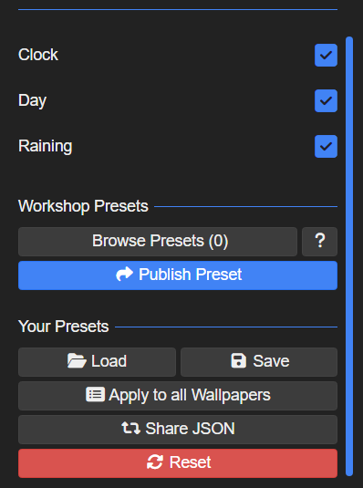

# 🎬 Wallpaper Engine MPKG to MP4 Inspector & Extractor

[](LICENSE.txt)
[](https://www.python.org/)
[](https://github.com/TomSchimansky/CustomTkinter)
[](#)

A modern desktop application built with Python & **CustomTkinter** to inspect, preview, and selectively extract raw video (`.mp4`, `.webm`, `.mkv`), audio, and thumbnails from Wallpaper Engine mobile and desktop packages (`.mpkg` and `.pkg`) without re-encoding (*lossless extraction*).

---

## 📥 How to Get the .mpkg / .pkg File from Wallpaper Engine

To export and get the `.mpkg` file from Wallpaper Engine:

1. **Right-click** on the wallpaper in Wallpaper Engine that you want to export.
2. Select **"Send to Mobile Device"**.
3. Click **"Export .mpkg"** and save the file to your computer.

> 💡 **Tip for Desktop `.pkg` files:** You can also right-click any wallpaper in Wallpaper Engine and choose **"Open in Explorer"** to locate the `scene.pkg` file directly.

---

## ⏱️ The Clock Widget Problem — Solved!

Many users exporting wallpapers from Wallpaper Engine to mobile devices (`.mpkg`) notice an unwanted clock, date, day of week, or weather widget displayed on top of the wallpaper.

<p align="center">
  
</p>

* **The Cause:** In Wallpaper Engine, elements like `Clock`, `Day`, and `Raining` (shown in the settings above) are **interactive overlay widgets**—they are completely separate from and unrelated to the underlying video footage.
* **The Fix:** The solution is to **disable and strip away the clock, date, and any other non-video overlay elements** that are unrelated to the video. This tool achieves this automatically by parsing the package container and extracting only the pure, raw `.mp4` video stream. The result is a **100% clean video** with all clock and date widgets completely removed!

---

## ✨ Features

* **🖼️ Visual Preview & Metadata**:
  * Displays the embedded wallpaper thumbnail (`preview.jpg` / `preview.png`) in-memory before extraction.
  * Reads `project.json` to show the original Steam Workshop title, wallpaper type, and clock widget settings.
* **📋 Selective Asset Checklist**:
  * Lists all internal assets (Videos, Soundtracks, Images/Textures, Configs) with file sizes and category badges.
  * Quick filter buttons: **🎬 Video Only**, **🎵 Video + Audio**, **Select All**, and **Deselect All**.
* **🏷️ Smart Output Naming**:
  * *Use Wallpaper Title (Recommended)*: Automatically names the video after the original Steam Workshop title (e.g. `Cyberpunk_City_4K.mp4`).
  * *Use Internal Package Filename*.
  * *Use .mpkg Archive Filename*.
* **⚡ Native Binary Parser**:
  * Supports Wallpaper Engine binary headers (`PKGV0001`, `PKGV0002`, `PKGV0003`, `PKGM0014`, etc.).
  * Automatic fallback for ZIP-based mobile packages and nested sub-packages.
* **▶️ Instant Video Playback**:
  * Launch and verify extracted videos directly in your default media player with one click.
* **🧵 Thread-Safe GUI**:
  * Heavy file I/O runs in isolated background threads so the UI never freezes or stutters.

---

## 🚀 Getting Started

### Method 1: One-Click Windows Launcher (Easiest)
Simply **double-click** on:
```text
run.bat
```
The script will check your Python installation, automatically install required packages (`customtkinter`, `pillow`) if missing, and launch the application.

### Method 2: Command Line (GUI)
1. Clone this repository:
   ```bash
   git clone https://github.com/brony0710/wallpaper-engine-mpkg-to-mp4.git
   cd wallpaper-engine-mpkg-to-mp4
   ```
2. Install dependencies:
   ```bash
   pip install -r requirements.txt
   ```
3. Run the application:
   ```bash
   python main.py
   ```

### Method 3: CLI Batch Mode (Headless)
Extract videos directly from your terminal without opening the GUI:
```bash
python main.py "path/to/wallpaper.mpkg" -o "path/to/output_folder"
```

---

## 🛡️ Security & Antivirus Transparency

* **100% Open Source:** All source code is completely open, readable, and unobfuscated.
* **100% Offline:** The app runs entirely on your local machine and never connects to external servers or collects data.
* **Zero False Positives:** Because it runs directly via Python scripts (rather than an unsigned compiled `.exe`), it will never trigger false positive virus warnings from Windows Defender or third-party antivirus software.
* **MIT Licensed:** Free for personal and commercial use under the [MIT License](LICENSE.txt).

---

## 📁 Project Structure

```text
wallpaper-engine-mpkg-to-mp4/
├── LICENSE.txt       # Official MIT License
├── README.md         # Documentation and guide
├── requirements.txt  # Python package dependencies
├── run.bat           # Windows one-click launcher
├── extractor.py      # Core binary parser & package inspector
├── gui.py            # Modern CustomTkinter GUI interface
└── main.py           # Application entry point (GUI & CLI)
```

---

## 🤝 Contributing

Contributions, feature suggestions, and bug reports are welcome! Feel free to open an issue or submit a pull request.

## 👤 Author & Copyright

* **Developer:** [brony0710](https://github.com/brony0710)
* **Copyright:** © 2026 brony0710. All rights reserved under the MIT License.

---

## 📄 License

Distributed under the MIT License. See [LICENSE.txt](LICENSE.txt) for more information.
